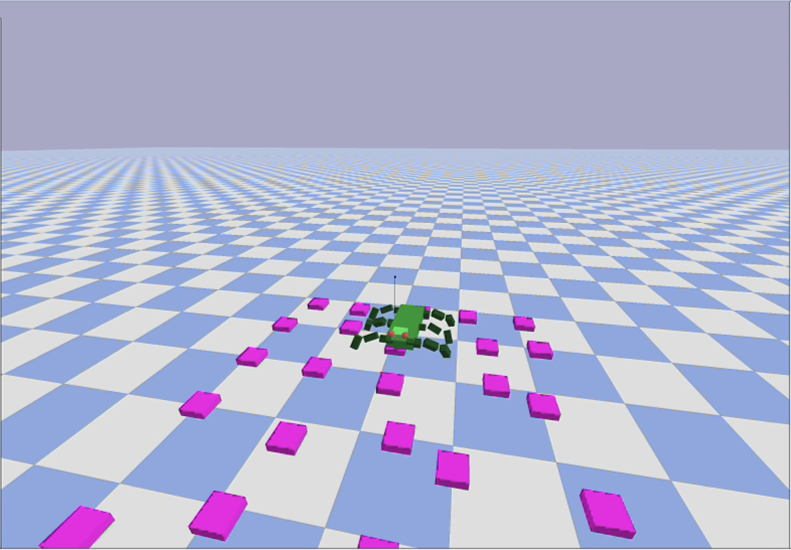

# EVO Hexapod

Evolutionary Hexapod Robot Simulation in Python

<div align="center">
  
</div>

## Overview

This project is a Python implementation of an evolutionary robotics simulation for a six-legged (hexapod) robot. The robot learns to walk, turn left, and turn right through genetic algorithms, specifically using Vector Evaluated Genetic Algorithms (VEGA).

The simulation uses PyBullet for physics and visualization, replacing the ODE (Open Dynamics Engine).

## Features

- 6-legged robot simulation with realistic physics
- Genetic algorithm implementation (VEGA) for evolving locomotion patterns
- Multiple fitness objectives (forward motion, left turns, right turns)
- Interactive visualization with PyBullet
- Configurable robot parameters and evolution settings

## Installation

1. Clone the repository:
```bash
git clone https://github.com/yourusername/evo-hexapod-py.git
cd evo-hexapod-py
```

2. Create and activate a Conda environment:
```bash
conda create --prefix hexapod-env python=3.9
conda activate ./hexapod-env
```

3. Install the required dependencies:
```bash
pip install -r requirements.txt
```

4. Install the package (optional, for development):
```bash
pip install -e .
```

## Usage

Run the main simulation:

```bash
python examples/run_evolution.py
```

Controls:
- Press 's' to start the robot movement
- Press 'x' to exit the simulation

## Project Structure

```
evo-hexapod-py/
├── src/
│   ├── __init__.py
│   ├── robot.py             # Robot model classes
│   ├── genetic.py           # VEGA genetic algorithm
│   ├── environment.py       # Environmental setup and obstacles
│   ├── simulation.py        # Physics simulation handling
│   └── visualization.py     # Rendering functions
├── examples/
│   └── run_evolution.py     # Main script to run the simulation
├── assets/
│   └── textures/            # Textures for rendering
├── tests/
│   ├── __init__.py
│   ├── test_robot.py
│   └── test_genetic.py
├── README.md
├── requirements.txt
└── setup.py
```

## Configuration

You can modify various parameters in the code:

- In `genetic.py`:
  - `GAN`: Population size
  - `timesmax`: Number of posture changes before evaluation
  - `qmin`, `qrange`, `qinit`: Joint angle limits and initial values

- In `robot.py`:
  - Robot dimensions and mass properties
  - Leg configuration

- In `environment.py`:
  - Obstacle properties and placement

## How It Works

1. The simulation initializes a population of random motion patterns
2. Each pattern consists of a sequence of postures (joint angles)
3. The robot executes each pattern and is evaluated on:
   - Forward distance traveled
   - Ability to turn left
   - Ability to turn right
4. The genetic algorithm selects, combines, and mutates the best patterns
5. Over generations, the robot evolves efficient locomotion strategies

## License

This project is licensed under the MIT License - see the LICENSE file for details.

## Acknowledgments

This project is a Python port of an original C++ implementation using ODE.